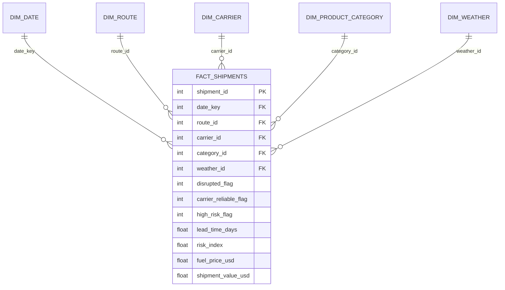

# Power BI Star Schema Data Model — Global Supply Chain & Logistics Intelligence

```mermaid
erDiagram
    DIM_DATE ||--o{ FACT_SHIPMENTS : "date_key"
    DIM_ROUTE ||--o{ FACT_SHIPMENTS : "route_id"
    DIM_CARRIER ||--o{ FACT_SHIPMENTS : "carrier_id"
    DIM_PRODUCT_CATEGORY ||--o{ FACT_SHIPMENTS : "category_id"
    DIM_WEATHER ||--o{ FACT_SHIPMENTS : "weather_id"

    FACT_SHIPMENTS {
        int shipment_id PK
        int date_key FK
        int route_id FK
        int carrier_id FK
        int category_id FK
        int weather_id FK
        int disrupted_flag
        int carrier_reliable_flag
        int high_risk_flag
        float lead_time_days
        float risk_index
        float fuel_price_usd
        float shipment_value_usd
    }
```
